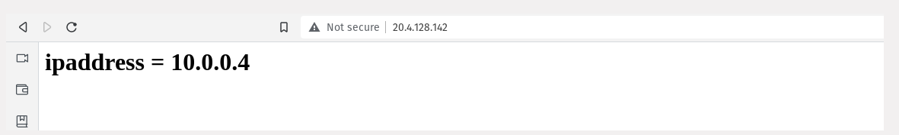

### I have created 2 VM without public IP, but I haven't created a bastion host, inside VM's I have installed apache used Custom data and cloud init, on the HTML page I printed local IP address

#### First VM

#### Second VM
